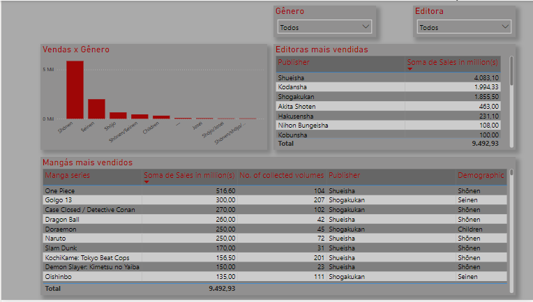

# Visualizing top selling Mangas

## Link to dataset (Kaggle)
https://www.kaggle.com/datasets/drahulsingh/best-selling-manga

## Problem
A bookstore owner wants to start selling Manga books this year, but he doesn't know much about this genre.
In this sense, he gave us a dataset about the best selling manga along the years and he want a PowerBI dashboard to visualize some informations and take insights.

## Important informations in Dashboard

<ul>
    <li> Table with the top selling Manga books;
    <li> He wants to know Nº of Volumes, Demographic, Average Sales;
    <li> Table with the top selling Publishers.
    <li> He wants to filter the top Manga considering the demographic and Publisher. 
</ul>

## Dashboard

